# MineDock

**Run your Minecraft servers from one desktop app.** Create or import a server, open its console, manage worlds and keep verified backups on your computer.

[](https://github.com/Bobydeluxe/MineDock/releases/latest)
[](https://github.com/Bobydeluxe/MineDock/actions/workflows/ci.yml)
[](LICENSE)

[**Download MineDock**](https://github.com/Bobydeluxe/MineDock/releases/latest) · [Features](MineDock-Features.txt) · [Validation](docs/validation.md) · [Report a bug](https://github.com/Bobydeluxe/MineDock/issues/new/choose)

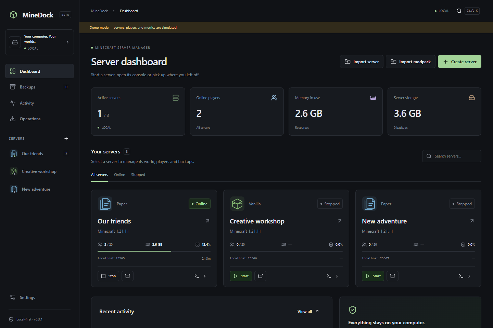

## Project status

MineDock is a **beta** for Windows, Linux and macOS. The latest published version is **0.3.0**. Current development source is **0.3.1**, with centered dialogs, a simpler creation wizard, original engine symbols and the complete Modrinth mod manager. It has not been published as a new release. The screenshots show the development interface; published 0.3.0 packages predate these changes.

English is the default. French, German, Spanish, Portuguese and Italian are bundled and available offline. Existing language preferences survive upgrades.

## Start using MineDock

1. [Download a package](https://github.com/Bobydeluxe/MineDock/releases/latest) for your OS and architecture.
2. Open MineDock and choose your language, appearance and storage folders.
3. Create a server or import an existing folder. Choose an engine, version and resources, then review the settings.
4. Personally accept the Minecraft EULA when required. Start the server and wait for its ready message before connecting your client.

| System  | Packages                               | Architectures                  |
| ------- | -------------------------------------- | ------------------------------ |
| Windows | Setup installer or portable executable | x64, ARM64                     |
| Linux   | AppImage or deb                        | x64, ARM64                     |
| macOS   | dmg or zip                             | Intel x64, Apple Silicon ARM64 |

Packages include Electron and its runtime; end users do not install Node or pnpm. Portable builds still store persistent data in your user profile. Current Windows/macOS packages are unsigned. Check the release notes and `SHA256SUMS.txt` for the package you download.

MineDock must stay open to supervise servers and run scheduled tasks. It stops servers gracefully when you close it. Downloads need Internet access; installed local servers can be administered offline. MineDock does not open firewall or router ports.

## What you can do

- **Manage servers:** separate profiles, official version catalogs, managed Java/PHP, start/stop/restart, live console, actual process metrics and crash explanations.
- **Manage content:** Modrinth for mods and Modrinth/Hangar for plugins; loader-compatible mods/plugins, dependencies, version comparisons, history and verified rollback. Configure supported Geyser/Floodgate crossplay variants.
- **Bring your existing work:** preview/copy an existing server, import worlds and Modrinth `.mrpack` files, keep originals and use safety backups before risky changes.
- **Administer locally:** worlds, files/ZIPs, syntax-aware editing, player lists, storage reports, verified backups, retention previews and daily/cron tasks.
- **Recover safely:** persistent operation history, cancellation, resumable downloads and reviewable recovery after interruption. Application updates verify signed metadata and downloaded bytes.

See the [complete feature list](MineDock-Features.txt) for exact capabilities and limits. Server binaries and plugins run with your OS privileges.

## Supported engines

These are original MineDock symbols, not official project logos. All eight assets ship locally under the [MIT license](LICENSE).

| Engine                                                                                                                    | Edition | Content support                                 |
| ------------------------------------------------------------------------------------------------------------------------- | ------- | ----------------------------------------------- |
|  Vanilla                  | Java    | Original game                                   |
|  Paper                        | Java    | Plugins                                         |
|  Purpur                     | Java    | Paper-compatible plugins                        |
|  Fabric                     | Java    | Fabric mods                                     |
|  Forge                        | Java    | Forge mods                                      |
| 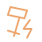 NeoForge               | Java    | NeoForge mods                                   |
|  Bedrock Dedicated Server | Bedrock | Native server; Windows/Linux x64                |
|  PocketMine-MP      | Bedrock | Its own PHP plugins; upstream support has ended |

Capabilities control the available actions. A native engine does not show Java memory settings, and a mod loader does not offer an incompatible plugin installer. See [engine availability](docs/engines.md).

## Interface

These are real captures of the running renderer in **explicitly labeled demo mode**. Sample servers, players and console output are simulated; the images do not establish Minecraft gameplay. A fresh desktop installation starts empty. The real Electron backend is tested separately.

| Create a server                                                                             | Manage a server                                                          |
| ------------------------------------------------------------------------------------------- | ------------------------------------------------------------------------ |
| 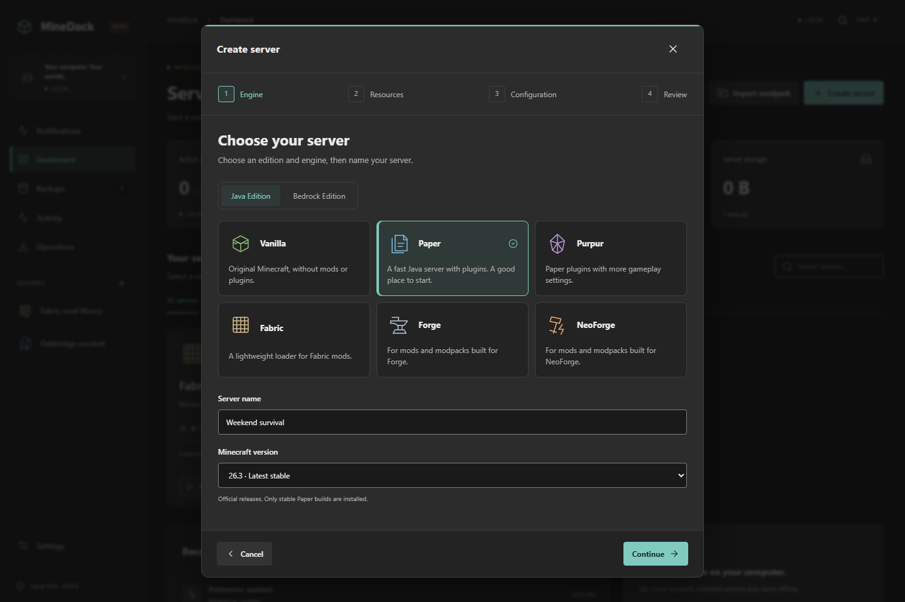 | 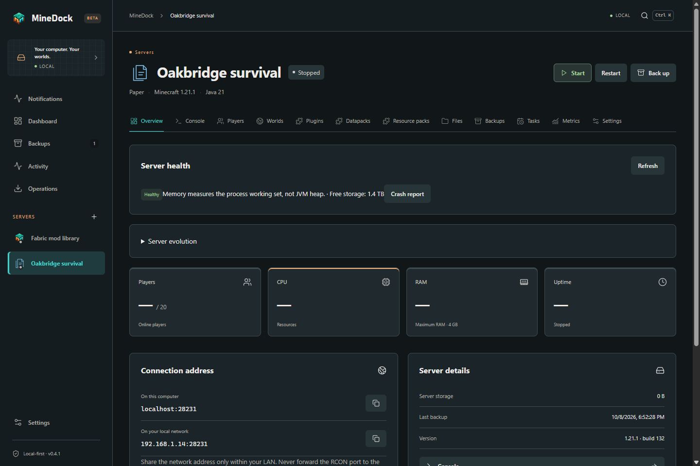         |
| **Console**                                                                                 | **Plugins and mods**                                                     |
| 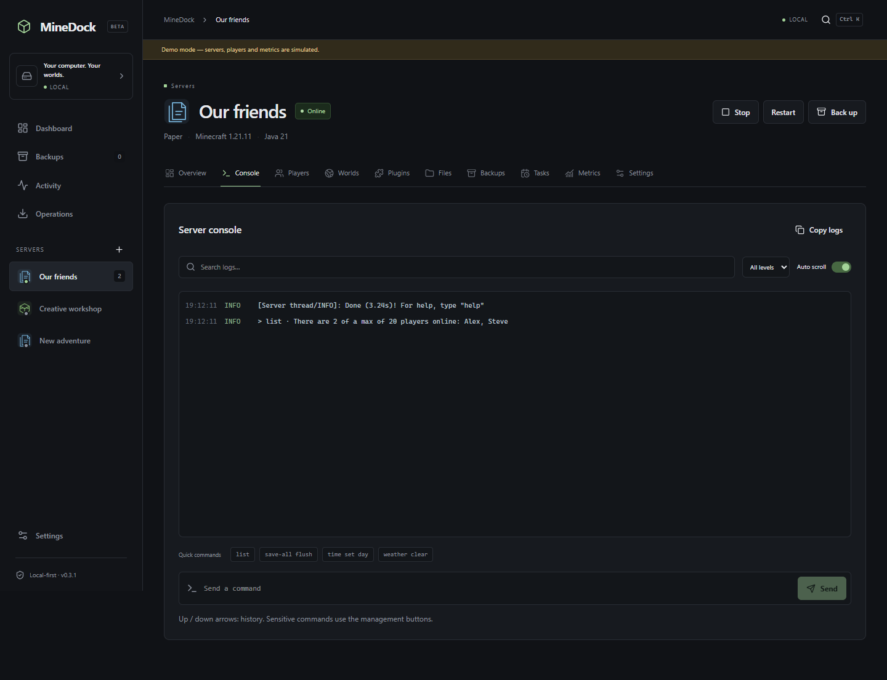                         | 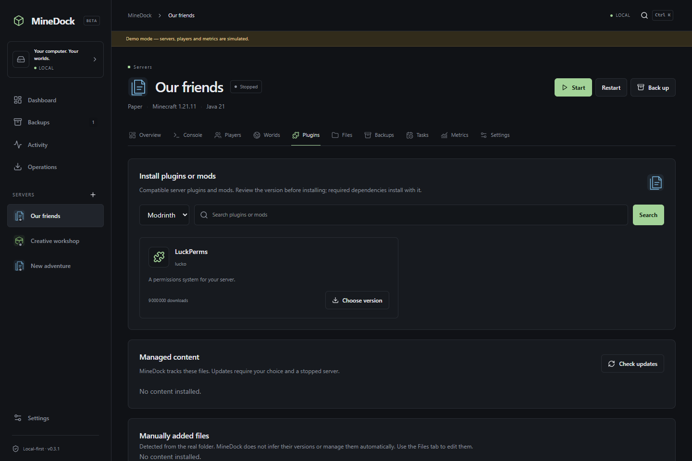     |
| **Backups**                                                                                 | **Worlds**                                                               |
| 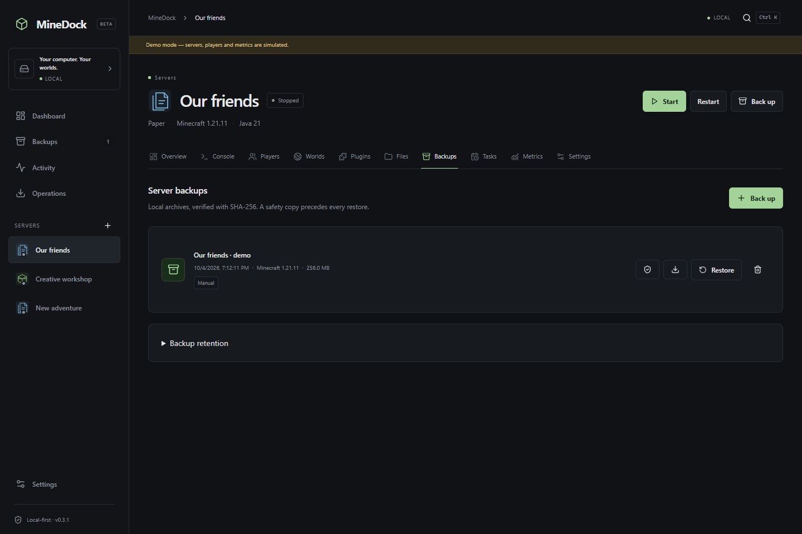                            | 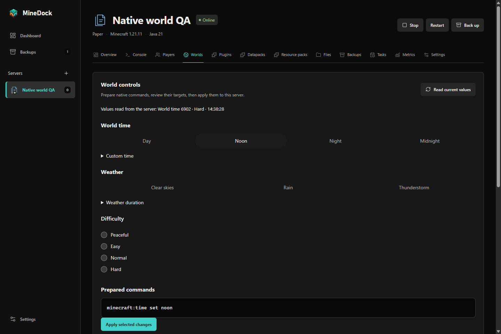 |

<details>
<summary>Creation summary and light appearance</summary>

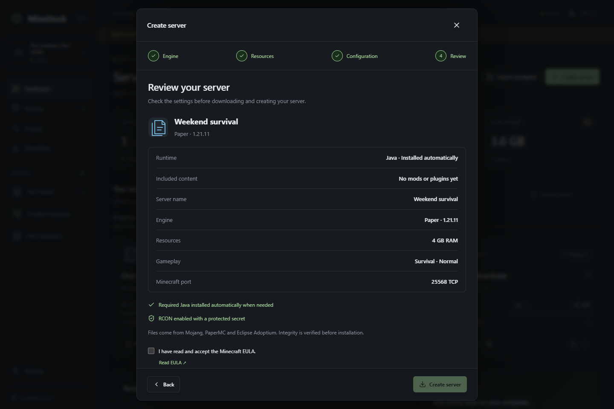

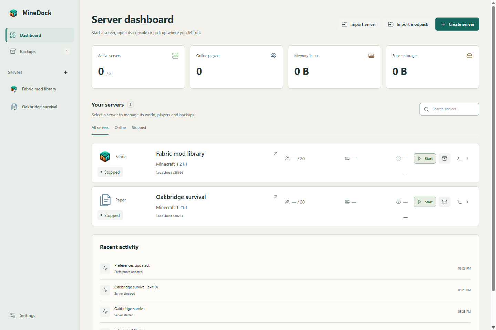

</details>

<details>
<summary>Actual Electron first start and empty dashboard</summary>

These captures use the real desktop/preload/SQLite services with isolated test storage. The first-start dialog fits a small native window; the fresh dashboard contains no sample servers. No Minecraft process is running.

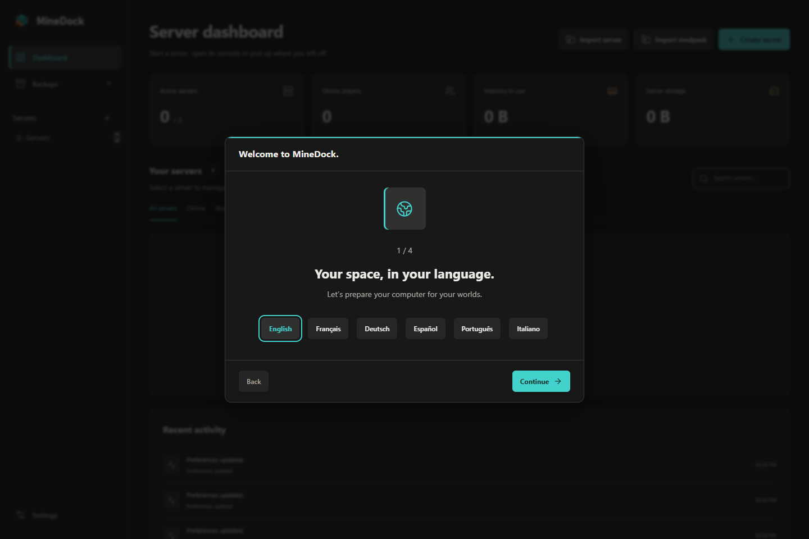

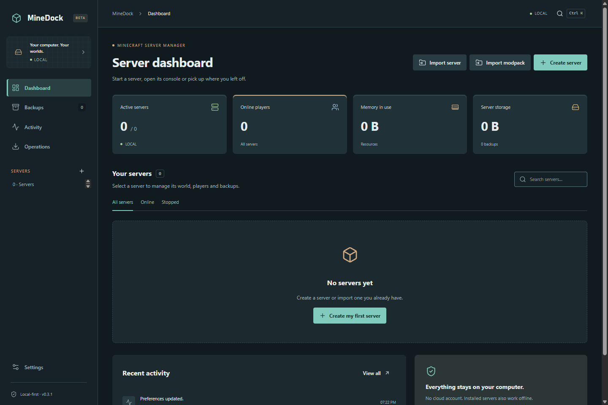

</details>

## Development

Requires **Node 24+ and pnpm 11+**. Build distribution packages on their native OS and architecture.

```sh
pnpm install --frozen-lockfile
pnpm dev
```

`pnpm dev` opens the real desktop services. `pnpm dev:mock` explicitly selects the browser demonstration; production never falls back to it.

```sh
pnpm lint
pnpm typecheck
pnpm test
pnpm build
pnpm test:ui
pnpm build:windows   # or build:linux / build:mac on the target OS
pnpm test:packaged
pnpm screenshots
```

Browser tests and screenshots need Playwright Chromium (`pnpm exec playwright install --with-deps chromium`), or Microsoft Edge on Windows. Linux GUI tests need a display/Xvfb and the stock Electron sandbox helper. Native packaging/GUI results and their exact source revisions are recorded in [validation](docs/validation.md).

Official-service probes are opt-in: `pnpm test:official --catalogs`, `pnpm test:official --runtimes --content` and `pnpm test:live`. The Paper live check stops at `eula=false`; it never accepts the real EULA for you.

## MOD MANAGEMENT

Modrinth is the mod catalogue for Fabric, Forge and NeoForge. Discover compatible server mods, review a recommended stable version and install required dependencies together. Optional dependencies are visible and never installed automatically.

Installed mods retain verified file hashes and Minecraft/loader metadata. Check updates explicitly, update selected mods or all unlocked mods, choose beta/alpha versions explicitly, restore archived versions and lock versions. Local favorites and reusable collections require no account. Shared dependencies remain installed; unused automatic dependencies are offered for removal.

Changes require a stopped server, use safety backups and stage all files before committing SQLite metadata. The mod health check runs before manual, automatic and scheduled starts. Manual JARs remain local until an explicit exact-hash identification. Offline inventory and local actions work without Modrinth.

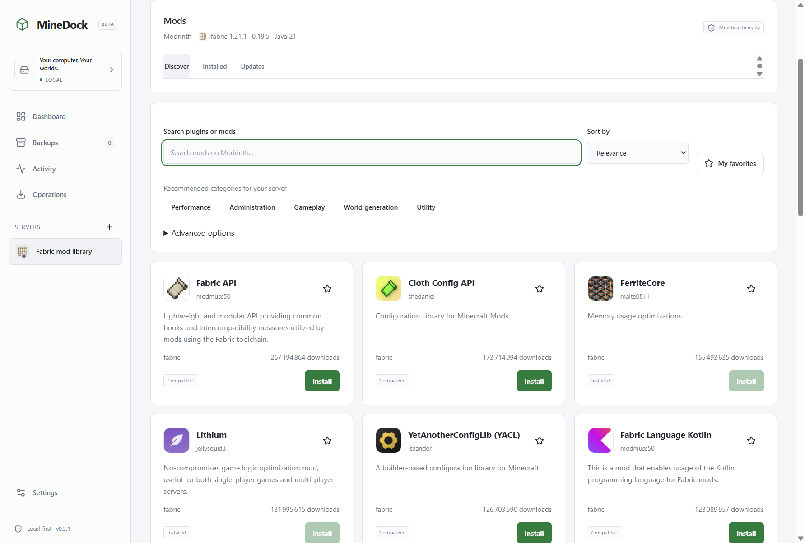

The screenshot shows an isolated desktop profile with real Modrinth metadata and downloaded, hash-verified mods. It is not a Minecraft gameplay test. See [mod management](docs/mods.md) for compatibility checks, collections and migration limits.

## Architecture and documentation

React renders the interface. A narrow typed preload connects it to one Electron main-process application core. SQLite stores profiles, preferences and operation history. Filesystem, process, networking and download services stay outside the renderer; the Electron sandbox and context isolation stay enabled.

| Document                             | Contents                                             |
| ------------------------------------ | ---------------------------------------------------- |
| [Architecture](docs/architecture.md) | Components, service boundaries and persistence       |
| [Security](docs/security.md)         | IPC, paths, archives, secrets and trust limits       |
| [Validation](docs/validation.md)     | Tests, native builds and unvalidated conditions      |
| [UI design](docs/ui.md)              | Dialog behavior, creation flow, symbols and captures |
| [Features](MineDock-Features.txt)    | Complete implemented scope                           |
| [Roadmap](docs/roadmap.md)           | Remaining validation and future scope                |
| [Contributing](CONTRIBUTING.md)      | Development and review expectations                  |

## Known limits and next work

- Real client gameplay, historical engine coverage and Bedrock crossplay connectivity still need live validation after personal consent.
- BDS has no official macOS/ARM64 distribution. Some native PHP ARM64 packages are unavailable. PocketMine releases may not support current Bedrock clients.
- Windows Authenticode and Apple signing/notarization need real certificates. Publisher update signatures do not imply OS signing.
- Actual newer-version OS upgrades, interactive installer flows and extended disk-full/power-loss/load tests remain separate validation work.

The [roadmap](docs/roadmap.md) distinguishes that work from future extensions such as Docker, remote accounts, cloud synchronization and general datapack/resource-pack management.

## License

Original code and engine symbols: [MIT](LICENSE). Packages include dependency license notices. MineDock is independent of Mojang, Microsoft and engine/content providers.
