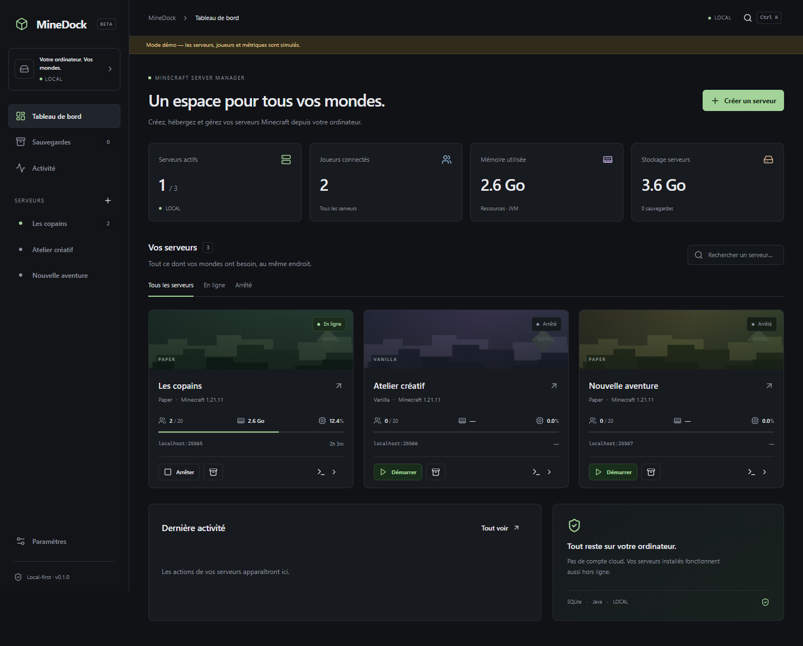

# MineDock

A local-first desktop Minecraft server manager. Your servers, worlds and backups stay on your computer. Original code under the MIT license.

The current source is **0.3.0 beta**. English is the primary project language and the default interface language. French, German, Spanish, Portuguese and Italian are also available offline, during setup and in Settings. Upgrades preserve the selected language.

## Install and start

Download published packages from [GitHub Releases](https://github.com/Bobydeluxe/MineDock/releases). Check the release version and its validation notes: older 0.2.0 executables do not contain the 0.3.0 extensions. [Validation](docs/validation.md) records actual native build and execution results; configured CI targets alone do not prove that a package works.

Windows has an installer for the current user and a portable executable. Linux targets AppImage and deb; macOS targets dmg and zip. Native x64 and ARM64 packages have separate names. Packages include Electron, Node and Chromium; end users do not install development tools. Persistent data remains in the user profile, including in the portable edition.

1. Open MineDock and choose a language and theme.
2. Choose an edition, engine and available version, or import an existing server.
3. Review the runtime, ports and summary. Personally accept the Minecraft EULA when required.
4. Start the server, wait for its actual ready message and connect a compatible Minecraft client.
5. Manage its console, players, files, worlds, content, backups and tasks.

MineDock must remain open to supervise processes and run tasks. Closing it stops servers gracefully. A first start can require further upstream downloads. Local administration works offline after the required files are present. The app does not configure your firewall or router.

## Implemented services and interface

- Eight engine adapters: Vanilla, Paper, Purpur, Fabric, Forge, NeoForge, Bedrock Dedicated Server and PocketMine-MP. Official catalogs, pinned builds, loader/installer selection, real install/launch paths and capability-based controls. Native-engine availability depends on upstream OS/architecture packages. PocketMine upstream has ended support; its release and supported Bedrock version are shown separately.
- Managed Temurin Java and PocketMine PHP ZTS, native version/architecture probes, atomic repair and guarded deletion with compatible replacements. Bedrock has no Java dependency.
- Independent processes, live virtualized console, commands, RCON where supported, graceful stop/restart, crash diagnostics, bounded crash recovery and real process CPU/RAM history.
- Modrinth, Hangar and configurable CurseForge providers; compatible mods/plugins, explicit versions and dependencies, provenance, raster icon cache, update comparisons, retained binary history, verified rollback and managed uninstall. Manual files and user configurations are preserved.
- Dedicated Geyser/Floodgate crossplay controls for supported engine variants, compatible versions, UDP port/authentication configuration and safety backups. Java online-mode is preserved.
- Native existing-server previews with editable uncertain values. Copying is the default; managing an original requires explicit confirmation and a byte-preserving safety archive. Ambiguous loader builds require a selection.
- Java/Bedrock world metadata from actual files, exact known seeds, logical dimension sets, import/export, duplicate, rename, select and inactive-world deletion, with stopped-server checks and safety backups.
- Modrinth `.mrpack` previews and actual verified server installation, pinned Minecraft/loader versions, server-side file selection, safe overrides and complete retry after interruption.
- Contained file browsing/editing, rename/move/copy, explicit overwrites, bounded ZIP compression/extraction, atomic exports, CodeMirror syntax highlighting and JSON/YAML syntax validation.
- Persistent observed players, reliable local UUID/XUID sources, actual operator/allowlist/ban formats, saved game statistics versus observed session time, search/filter/pagination and confirmed supported moderation. Unknown ping remains unavailable.
- On-demand storage categories, ninety saved reports, twenty largest files and native folder reveal. Shared application caches are excluded from per-server totals.
- Persistent interval, daily and cron tasks, timezone previews, readable cron descriptions, pause/resume and multiple restart warnings. Missed deadlines are advanced without replaying overdue work.
- Verified full-server ZIP backups, live Java save-hold where supported, staged restoration, safety copies and configurable retention previews. Purges require explicit confirmation; manual/safety backups are protected by default.
- Persistent long-operation history, progress, cancellation, resumable HTTP downloads, startup rollback/recovery and manual review of ambiguous copies. Launch/mutation is blocked while server recovery needs attention.
- Optional app-update checks, pinned Ed25519-signed metadata, exact OS/architecture/package matching and signed-size/SHA-256 downloads. Portable/AppImage/macOS bundle helpers preserve a previous copy; installer packages use their native installation flows. App updates do not update Minecraft servers.
- SQLite migrations preserving the published schema, structured validated IPC, application logs/audit, six interface languages, light/dark/system themes, local trash and temporary sleep prevention.

The [complete feature list](MineDock-Features.txt), [engine guide](docs/engines.md), [security](docs/security.md) and [roadmap](docs/roadmap.md) explain limits. The new services are covered by automated fixtures; this is not a claim that every Minecraft engine has been played on every OS. CurseForge needs an owner-provided API key. Windows/Apple certificates are absent, so current builds are unsigned. A release without trusted updater metadata cannot be installed through the updater.

## Development and validation

Requires Node 24+ and pnpm 11+. Build on the target native OS and architecture.

```sh
pnpm install --frozen-lockfile
pnpm dev
pnpm dev:mock
pnpm lint
pnpm typecheck
pnpm test
pnpm test:ui
pnpm build
pnpm build:windows
pnpm build:linux
pnpm build:mac
pnpm test:packaged
```

`dev` uses actual desktop services. `dev:mock` is an explicitly labeled browser demonstration; production never substitutes it for the real bridge. On Linux/macOS, install Playwright Chromium with `pnpm exec playwright install --with-deps chromium`; Linux GUI tests need a display or Xvfb. Electron 44 also provides `node node_modules/electron/install.js` to prefetch its binary before configuring the Linux sandbox helper.

External downloads are opt-in:

```sh
pnpm test:official --catalogs
pnpm test:official --runtimes --content
pnpm test:live
```

Official checks use isolated ignored data and real sources; runtime checks execute version probes only. The live Paper test deliberately writes `eula=false` and stops at the consent gate. No test accepts a real Minecraft EULA for you. See [development](docs/development.md), [distribution](docs/distribution.md), [update signing](docs/update-system.md), [imports](docs/import.md), [recovery](docs/recovery.md) and [architecture](docs/architecture.md).

New to GitHub? Read [the beginner guide](GITHUB-GUIDE.txt). Issues and source are in [Bobydeluxe/MineDock](https://github.com/Bobydeluxe/MineDock).

## Preview



This older screenshot shows labeled demo mode. A fresh installation starts with an empty server list.

MineDock is not affiliated with Mojang, Microsoft or the engine/content providers. [Minecraft Server Manager](https://github.com/anefzaoui/minecraft-server-manager) and [PocketMC](https://pocketmc.github.io/) were functional research references only; no code or assets were copied.
