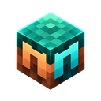
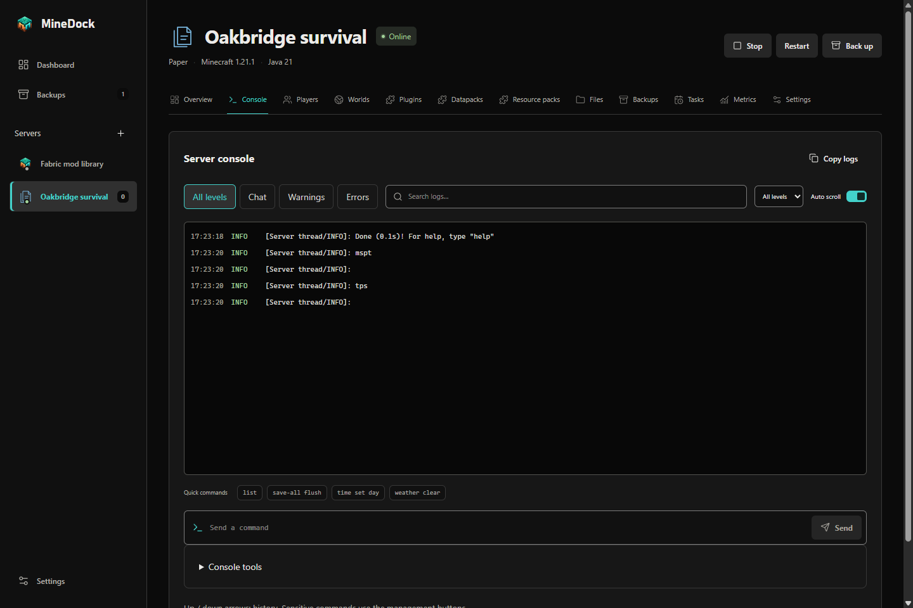
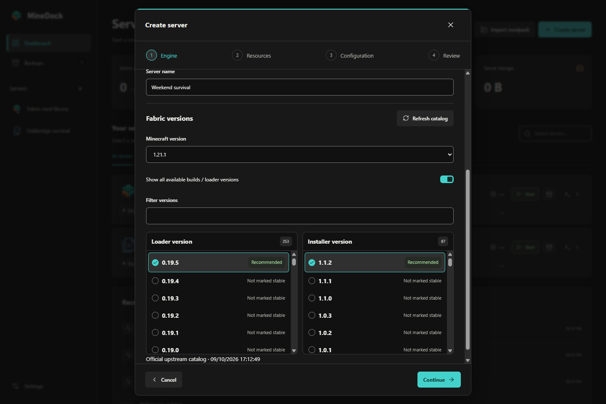
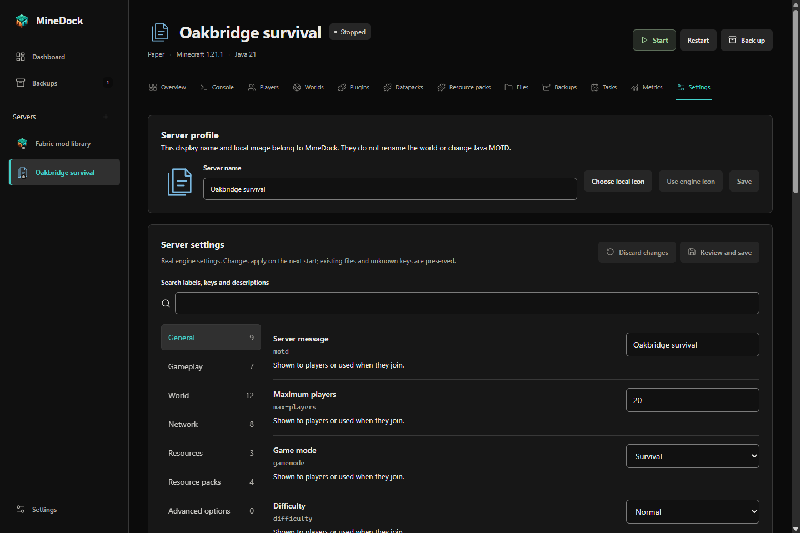

#  MineDock

**Run your Minecraft servers from one desktop app.** Create or import a server, open its console, manage worlds and keep verified backups on your computer.

[](https://github.com/Bobydeluxe/MineDock/releases/tag/v0.4.0)
[](https://github.com/Bobydeluxe/MineDock/actions/workflows/ci.yml)
[](LICENSE)

[**Download MineDock**](https://github.com/Bobydeluxe/MineDock/releases/tag/v0.4.0) · [Website](https://minedock-friends.arcane-rhea-3082.chatgpt.site) · [User guide](docs/user-guide.md) · [Features](MineDock-Features.txt) · [Report a bug](https://github.com/Bobydeluxe/MineDock/issues/new/choose)


## Project status

The current public version is **MineDock 0.4.0** for Windows, Linux and macOS. This release focuses on a survival world with friends: Modrinth mods/plugins/packs, player records, incremental backups, reviewed migrations, performance and configuration tools. It includes warm light and neutral charcoal dark themes. See the [release notes](https://github.com/Bobydeluxe/MineDock/releases/tag/v0.4.0), [complete features and limits](docs/survival-evolution.md) and [validation record](docs/validation.md).

English is the default. French, German, Spanish, Portuguese and Italian are bundled and available offline. Existing language preferences survive upgrades.

**0.4.1 is the review build on this branch, not a published download.** It adds the approved cube icon, full engine build lists, independently pinned Fabric choices, reviewed engine-specific properties and local profile images. The cleaned interface uses neutral black surfaces and direct Dashboard/Backups/Servers/Settings navigation. Notification preferences/history and recovery tools live inside Settings; the global breadcrumb/search strip and decorative ribbons are removed. [UI cleanup](docs/design/cleanup-041/README.md) and [validation](docs/validation.md) distinguish the candidate from public 0.4.0.

## Start using MineDock

1. [Download a package](https://github.com/Bobydeluxe/MineDock/releases/tag/v0.4.0) for your OS and architecture.
2. Open MineDock and choose your language, appearance and storage folders.
3. Create a server or import an existing folder. Choose an engine, version and resources, then review the settings.
4. Personally accept the Minecraft EULA when required. Start the server and wait for its ready message before connecting your client.

| System  | Packages                               | Architectures                  |
| ------- | -------------------------------------- | ------------------------------ |
| Windows | Setup installer or portable executable | x64, ARM64                     |
| Linux   | AppImage or deb                        | x64, ARM64                     |
| macOS   | dmg or zip                             | Intel x64, Apple Silicon ARM64 |

Packages include Electron and its runtime; end users do not install Node or pnpm. Portable builds still store persistent data in your user profile. Current Windows/macOS packages are unsigned. Check the release notes and `SHA256SUMS.txt` for the package you download.

MineDock must stay open to supervise servers and run scheduled tasks. It stops servers gracefully when you close it. Downloads need Internet access; installed local servers can be administered offline. MineDock does not open firewall or router ports.

### Upgrade from 0.3.x

Close MineDock first, keep your existing storage folders, and open the verified 0.4.0 package using the same OS account. Servers, settings, backups, Java/PHP runtimes, player records and scheduled tasks stay in your existing profile; SQLite is backed up before its schema changes. On Windows, the old 0.3.0 automatic launcher can fail before its helper runs: download and open the new portable or Setup package manually instead. Do not delete your old data. See [the migration evidence](docs/validation.md).

## What you can do

- **Manage servers:** separate profiles, official version catalogs, managed Java/PHP, start/stop/restart, live console, actual process metrics and crash explanations.
- **Manage content:** Modrinth for mods and Modrinth/Hangar for plugins; loader-compatible mods/plugins, dependencies, version comparisons, history and verified rollback. Configure supported Geyser/Floodgate crossplay variants.
- **Bring your existing work:** preview/copy an existing server, import worlds and Modrinth `.mrpack` files, keep originals and use safety backups before risky changes.
- **Administer locally:** worlds, files/ZIPs, syntax-aware editing, player lists, storage reports, verified backups, retention previews and daily/cron tasks.
- **Recover safely:** persistent operation history, cancellation, resumable downloads and reviewable recovery after interruption. Application updates verify signed metadata and downloaded bytes.
- **Keep a survival world healthy:** contextual datapacks/resource packs, local player notes and sessions, grouped notifications, crash evidence, file-level incremental backups and exact partial-restore previews.
- **Make changes deliberately:** Minecraft and Paper/Purpur compatibility reviews, full or fresh-world clones, console macros, measured TPS/MSPT where supported, safe JVM presets and configuration history.
- **Move to another PC:** preview a verified `.minedock` archive, then prepare new local paths, ports, official engine and runtime. Review [export privacy](docs/package-format.md) before sharing.

See the [complete feature list](MineDock-Features.txt) for exact capabilities and limits. Server binaries and plugins run with your OS privileges.

## Supported engines

These are original MineDock symbols, not official project logos. All eight assets ship locally under the [MIT license](LICENSE).

| Engine                                                                                                                    | Edition | Content support                                 |
| ------------------------------------------------------------------------------------------------------------------------- | ------- | ----------------------------------------------- |
|  Vanilla                  | Java    | Original game                                   |
|  Paper                        | Java    | Plugins                                         |
|  Purpur                     | Java    | Paper-compatible plugins                        |
|  Fabric                     | Java    | Fabric mods                                     |
|  Forge                        | Java    | Forge mods                                      |
|  NeoForge               | Java    | NeoForge mods                                   |
|  Bedrock Dedicated Server | Bedrock | Native server; Windows/Linux x64                |
|  PocketMine-MP      | Bedrock | Its own PHP plugins; upstream support has ended |

Capabilities control the available actions. A native engine does not show Java memory settings, and a mod loader does not offer an incompatible plugin installer. See [engine availability](docs/engines.md).

## Interface

These are actual MineDock 0.4.1 review-build native Electron captures, refreshed on 9 October 2026 using isolated local profiles and the real preload/core/SQLite services. The mod files are actual verified Modrinth downloads; world/player/administration records are QA fixtures. Active process and console views use an inert external Node child, which is never shipped. They are interface evidence, not Minecraft gameplay. A fresh installation starts empty. See [capture provenance and every current screen](docs/screenshots/README.md).

| Create a server                                                                             | Manage a server                                                          |
| ------------------------------------------------------------------------------------------- | ------------------------------------------------------------------------ |
|  |          |
| **Console**                                                                                 | **Plugins**                                                              |
|          |      |
| **Backups**                                                                                 | **Worlds**                                                               |
|                             |  |

| **Full Fabric versions**                                                                        | **Reviewed server settings**                                                  |
| ----------------------------------------------------------------------------------------------- | ----------------------------------------------------------------------------- |
|  |  |

<details>
<summary>Creation summary and light appearance</summary>


</details>

<details>
<summary>Actual Electron first start and empty dashboard</summary>

These captures use the real desktop/preload/SQLite services with isolated storage and the same 1440 × 960 native content viewport as the gallery. The fresh dashboard contains no servers. No Minecraft process is running.


</details>

## Development

The [complete gallery](docs/screenshots/README.md) also includes players, files, scheduler, runtimes, settings, import, active server states, menus and both themes. The [visual review](docs/design/visual-review.md) compares Dashboard, Create server, Server overview and Mods before/after, with measured layout and accessibility results.

Requires **Node 24+ and pnpm 11+**. Build distribution packages on their native OS and architecture.

```sh
pnpm install --frozen-lockfile
pnpm dev
```

`pnpm dev` opens the real desktop services. `pnpm dev:mock` explicitly selects the browser demonstration; production never falls back to it.

```sh
pnpm lint
pnpm typecheck
pnpm test
pnpm build
pnpm test:ui
pnpm build:windows   # or build:linux / build:mac on the target OS
pnpm test:packaged
pnpm screenshots
```

Browser tests need Playwright Chromium (`pnpm exec playwright install --with-deps chromium`), or Microsoft Edge on Windows. Screenshots use the compiled native Electron app; first use downloads three compatible Modrinth mods into private review storage. Linux GUI tests/captures need a display/Xvfb and the stock Electron sandbox helper. Native packaging/GUI results and their exact source revisions are recorded in [validation](docs/validation.md).

Official-service probes are opt-in: `pnpm test:official --catalogs`, `pnpm test:official --runtimes --content` and `pnpm test:live`. The Paper live check stops at `eula=false`; it never accepts the real EULA for you.

## MOD MANAGEMENT

Modrinth is the mod catalogue for Fabric, Forge and NeoForge. Discover compatible server mods, review a recommended stable version and install required dependencies together. Optional dependencies are visible and never installed automatically.

Installed mods retain verified file hashes and Minecraft/loader metadata. Check updates explicitly, update selected mods or all unlocked mods, choose beta/alpha versions explicitly, restore archived versions and lock versions. Local favorites and reusable collections require no account. Shared dependencies remain installed; unused automatic dependencies are offered for removal.

Changes require a stopped server, use safety backups and stage all files before committing SQLite metadata. The mod health check runs before manual, automatic and scheduled starts. Manual JARs remain local until an explicit exact-hash identification. Offline inventory and local actions work without Modrinth.


The screenshot shows an isolated desktop profile with real Modrinth metadata and downloaded, hash-verified mods. It is not a Minecraft gameplay test. See [mod management](docs/mods.md) for compatibility checks, collections and migration limits.

## Architecture and documentation

React renders the interface. A narrow typed preload connects it to one Electron main-process application core. SQLite stores profiles, preferences and operation history. Filesystem, process, networking and download services stay outside the renderer; the Electron sandbox and context isolation stay enabled.

| Document                                           | Contents                                                |
| -------------------------------------------------- | ------------------------------------------------------- |
| [Architecture](docs/architecture.md)               | Components, service boundaries and persistence          |
| [Security](docs/security.md)                       | IPC, paths, archives, secrets and trust limits          |
| [Validation](docs/validation.md)                   | Tests, native builds and unvalidated conditions         |
| [UI design](docs/ui.md)                            | Dialog behavior, creation flow, symbols and captures    |
| [Features](MineDock-Features.txt)                  | Complete implemented scope                              |
| [Roadmap](docs/roadmap.md)                         | Remaining validation and future scope                   |
| [User guide](docs/user-guide.md)                   | First survival, content, friends, backups and repairs   |
| [Changelog](CHANGELOG.md)                          | User-facing changes and known issues                    |
| [Internal security review](docs/security-audit.md) | Attack surfaces, evidence and external-review questions |
| [Contributing](CONTRIBUTING.md)                    | Development and review expectations                     |

## Known limits and next work

- Real client gameplay, historical engine coverage and Bedrock crossplay connectivity still need live validation after personal consent.
- BDS has no official macOS/ARM64 distribution. Some native PHP ARM64 packages are unavailable. PocketMine releases may not support current Bedrock clients.
- Windows Authenticode and Apple signing/notarization need real certificates. Publisher update signatures do not imply OS signing.
- Windows x64 installation/uninstallation and real packaged updater results are recorded in [validation](docs/validation.md). Other native OS installation/upgrades and extended disk-full/power-loss/load tests remain separate work.
- Incremental objects have no automatic garbage collector; partial restoration currently uses incremental snapshots. Unknown migration compatibility blocks changes, and changed pack releases require an explicit update/removal first.

The [roadmap](docs/roadmap.md) distinguishes remaining validation from future extensions such as Docker, remote accounts and cloud synchronization.

## License

Original code and engine symbols: [MIT](LICENSE). Packages include dependency license notices. MineDock is independent of Mojang, Microsoft and engine/content providers.
