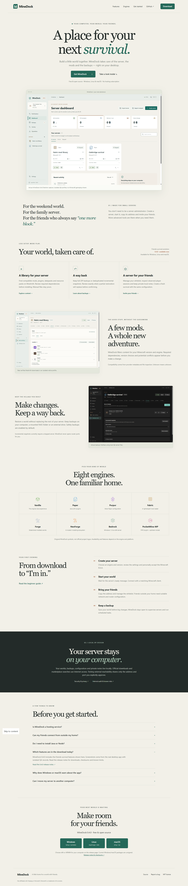
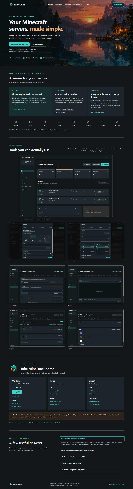
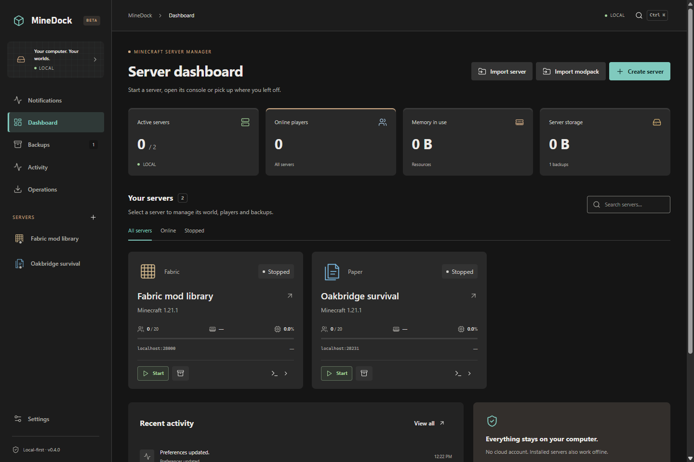
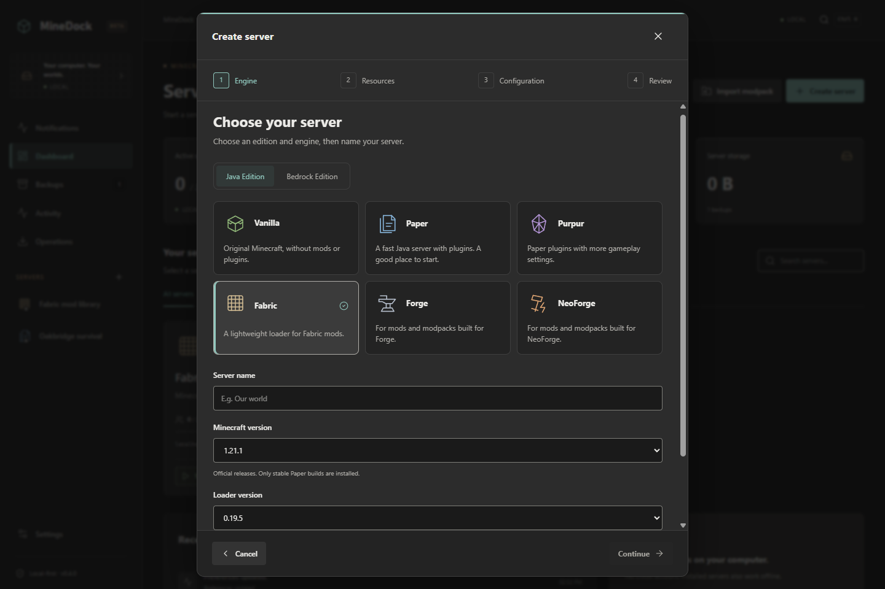
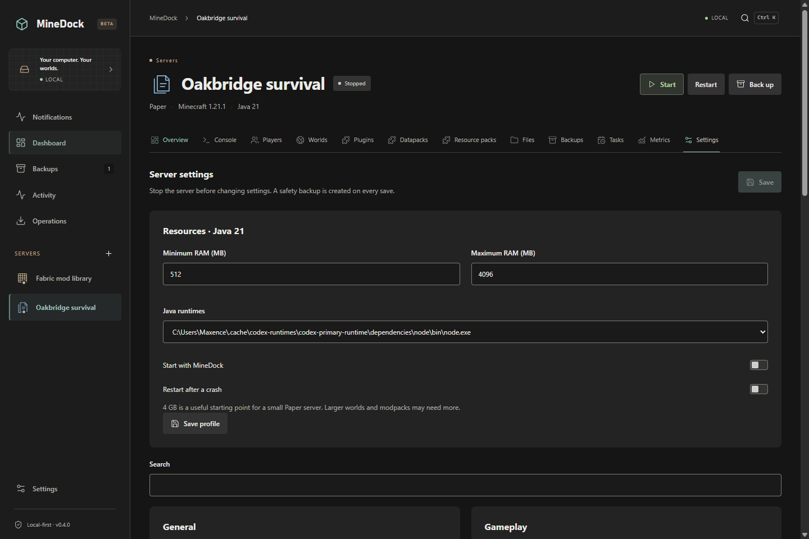
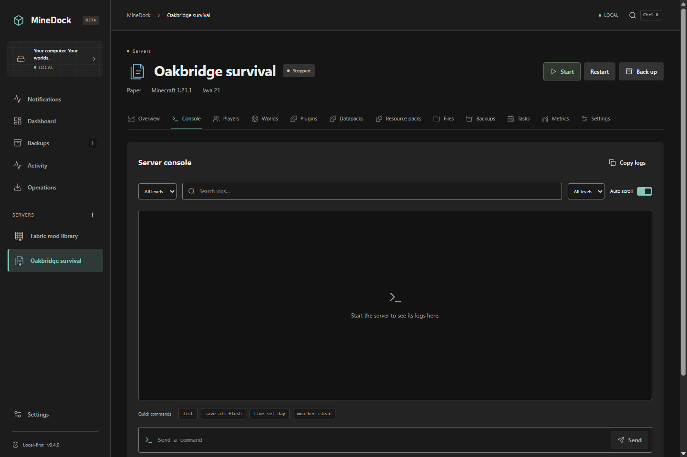
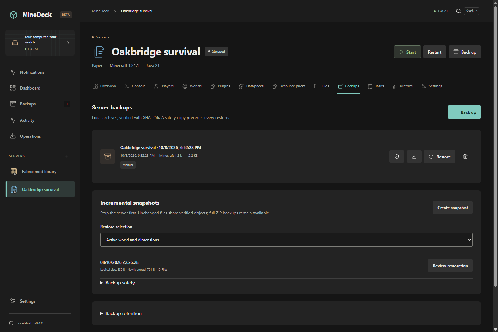

# Reference design — 0.4.1 review build

The owner's [actual reference collage](reference.png) is art direction. Every current app image is captured from compiled Electron/React controls backed by preload, core services and SQLite. No reference panel is embedded as a working screen. **The candidate is 0.4.1; the public download remains 0.4.0.**

| View       | Before — actual 0.4.0                    | After — actual 0.4.1 candidate                  | Result                                                                                             |
| ---------- | ---------------------------------------- | ----------------------------------------------- | -------------------------------------------------------------------------------------------------- |
| Website    |  |               | Approved mark, original survival sunset, useful sections and six actual platform download groups.  |
| Dashboard  |           |        | Compact aligned rows with available process data and clear start/backup/open actions.              |
| Create     |       |    | Compact engine tiles, a real engine-information panel and numbered steps.                          |
| Fabric     |     |  | Independently selectable complete loader/installer lists, search and upstream badges.              |
| Properties |     |  | Profile identity is separate; typed actual properties have categories, search and reviewed saving. |
| Console    |             |          | Real All/Chat/Warnings/Errors filters, existing command tools and readable logs.                   |
| Backups    |             |          | Manual/automatic and full/incremental filters use actual backup metadata.                          |

The before dashboard/create/console/backups files are the original main-branch 0.4.0 captures. Fabric/properties before captures additionally launch the unchanged executable extracted from the actual public 0.4.0 portable in an owned QA profile. The site before image is the previous production verification capture. Historical images are explicitly labeled and never used as the current product gallery.

Compared with the reference: layered blue-black/charcoal surfaces, restrained teal selection, copper accents, visible card boundaries, compact navigation and square rounded controls carry through the real pages. The light appearance retains its approved palette. Native dialogs, supported navigation and advanced tools are retained. Unknown CPU/player/TPS data stays unavailable. Shared styles also cover mods/plugins/packs, players, worlds, files, performance, notices, settings, imports, migration and recovery.

## Screenshot provenance

Current captures are 1440 × 960 content windows. Modrinth files are real verified downloads. The official version lists are real current/cached metadata. World/player/administration records and profile imagery are isolated QA fixtures. Active console/resource images use an inert external Node child with actual process measurements, not Minecraft multiplayer. Settings can scroll or use full-page capture. See [the complete gallery](../../screenshots/README.md) and [validation](../../validation.md).

Site review also covers [390](site-390.png), [768](site-768.png), [1280](site-1280.png), [1440](site-1440.png) and [1920](site-1920.png) pixels. The site says that its candidate screenshots are under review and that downloads are still public 0.4.0.

## Branding and publishing

The approved PNG remains byte-identical in [assets/brand](../../../assets/brand/README.md). Reproducible ICO/ICNS/PNG variants feed packaging. The original dusk illustration is documented with its prompt and source. The repository social preview is prepared as `assets/brand/social-preview.png`.

GitHub's social preview was uploaded through the supported repository web setting on October 9 and visually verified after reloading. [Actual setting proof](github-social-preview.png). To reproduce: open **Bobydeluxe/MineDock → Settings → General → Social preview → Edit → Upload an image**, then select that PNG. It is 1280 × 640, opaque and below 1 MB. No repository avatar was changed. See [GitHub's official instructions](https://docs.github.com/en/repositories/managing-your-repositorys-settings-and-features/customizing-your-repository/customizing-your-repositorys-social-media-preview).

The new application version requires explicit merge/release approval. Editing the existing 0.4.0 English release description and publishing the redesigned existing website are separately authorized; its 20 public assets remain unchanged.
