# MineDock visual identity review

This is a **style review**, based on the development mod-manager revision in [PR #5](https://github.com/Bobydeluxe/MineDock/pull/5). The application source version stays **0.3.1**; the latest public release stays **0.3.0**. No automatic merge or release is part of this review.

The existing sidebar, page order, cards, tabs, creation/import steps, dialogs and user journeys are retained. Production changes are confined to CSS tokens/styles, presentation classes, the editor highlight palette and eight original vector symbols. Server, download, database, RCON, backup, scheduler and update services are unchanged relative to the mod-manager branch.

## Palette and material system

| Role               | Dark                    | Light                  |
| ------------------ | ----------------------- | ---------------------- |
| Background         | `#111a1e`               | `#f3f1eb`              |
| Sidebar            | `#162228`               | `#e8ede9`              |
| Panel              | `#1c2a30`               | `#fcfbf7`              |
| Card               | `#213138`               | `#ffffff`              |
| Primary identity   | Oxidized teal `#80cabe` | Mineral teal `#17695f` |
| Secondary identity | Copper `#d0aa83`        | Copper `#875731`       |
| Success            | `#a2d299`               | `#376b35`              |
| Warning            | `#e6be79`               | `#825c13`              |
| Danger             | `#f0a4a5`               | `#a9343e`              |
| Information        | `#a5c6e2`               | `#315f84`              |

`apps/desktop/renderer/src/tokens.css` owns surfaces, three text levels, primary/secondary accents, semantic colors, control boundaries, hover/selection/focus, console/syntax colors, radii, overlay shadows and 140–180 ms transitions. Existing layout selectors keep their dimensions, spacing and responsive breakpoints. Buttons/fields use a 4 px radius, cards 8 px and dialogs 12 px. The native UI font stays readable; brand typography, label weights and tabular figures distinguish identity and hierarchy. There are no downloaded fonts or new runtime UI libraries.

Sidebar selections have an inset rail. Server cards use state rails and semantic status markers; metric panels and administration panels use different surfaces. Copper is reserved for secondary context such as worlds, archives and groups. Only the workspace carries a nearly transparent module grid. Shadows serve overlays and menus. Engine symbols retain their individual geometry/color without the shared enclosing tile. Mod/plugin icons keep their own identity.

The console remains a darker infrastructure surface in both themes, with readable timestamps, INFO/WARN/ERROR/CHAT colors and selection. The editor retains syntax categories using theme tokens. Transient server operations have a quiet indicator animation; reduced-motion preferences disable it. Existing action labels and keyboard paths remain intact.

## Before and after

The left images are explicitly historical comparisons. The right images represent the proposed current design. Every image is a real native Electron capture with isolated review storage at a 1440 × 960 content viewport and scale factor one.

| Screen          | Before                                                            | After                                                                    |
| --------------- | ----------------------------------------------------------------- | ------------------------------------------------------------------------ |
| Dashboard       | 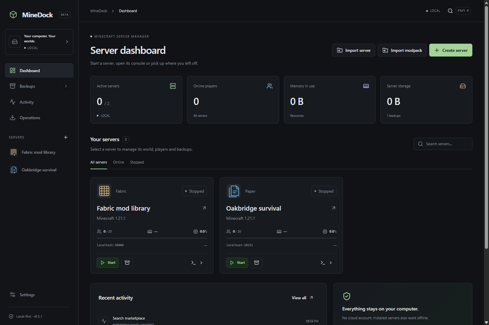                       |                        |
| Create server   | 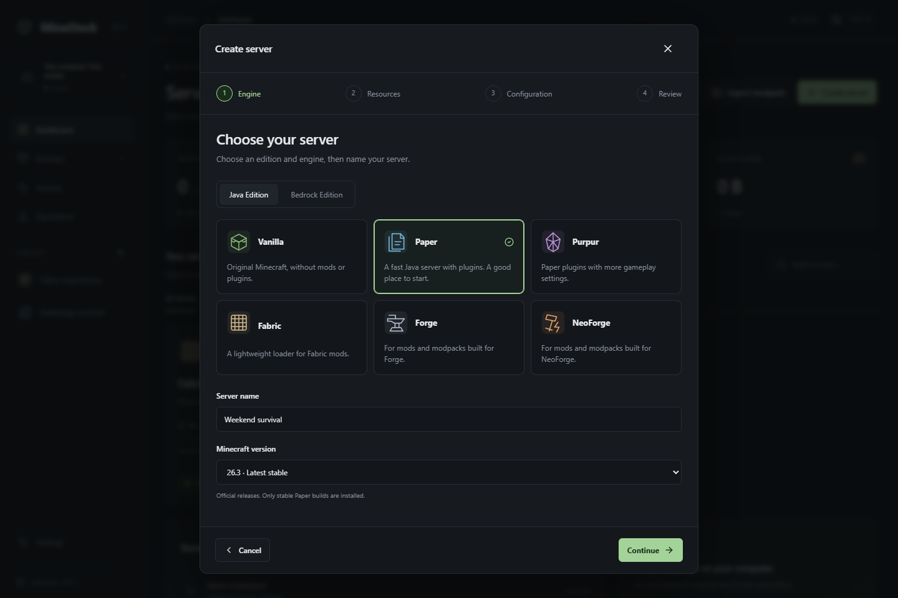             |              |
| Server overview | 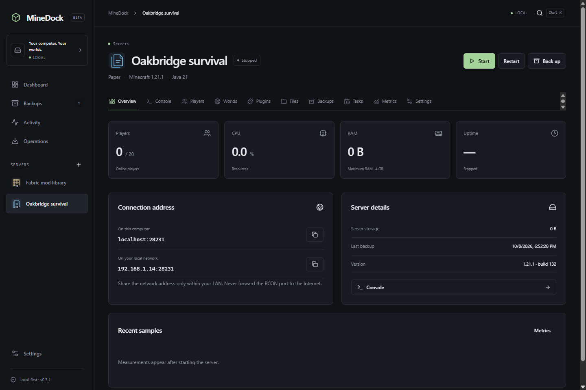                    |                     |
| Installed mods  | 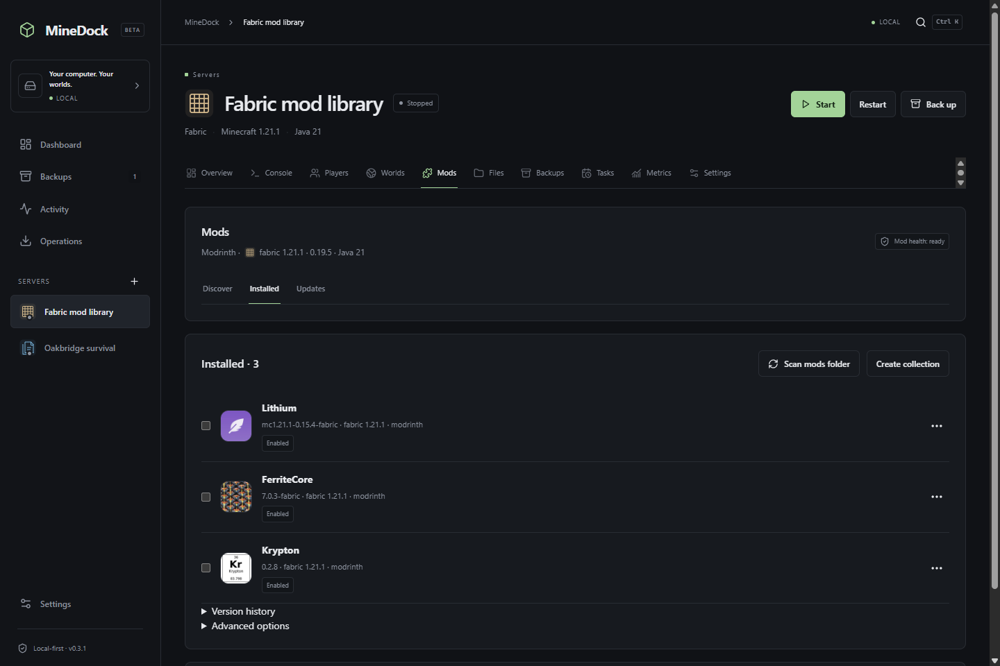                       |                        |
| Light dashboard | 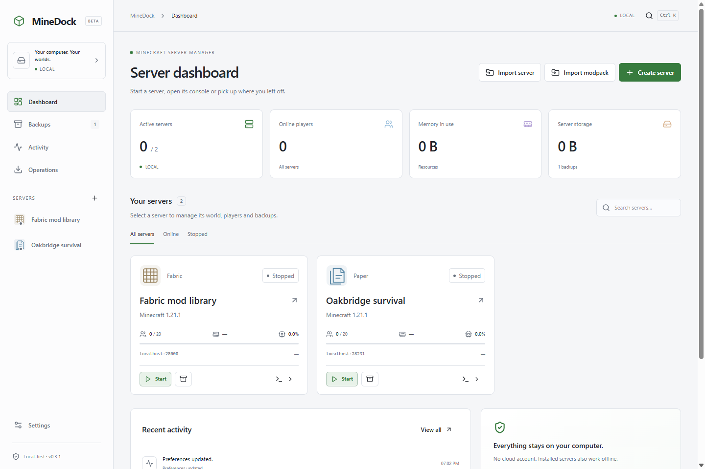           |            |
| Light creation  | 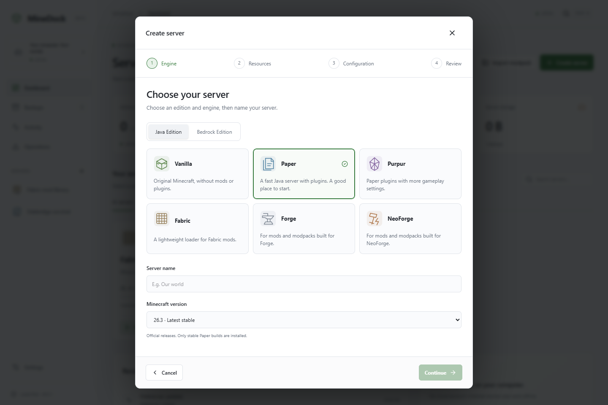 | 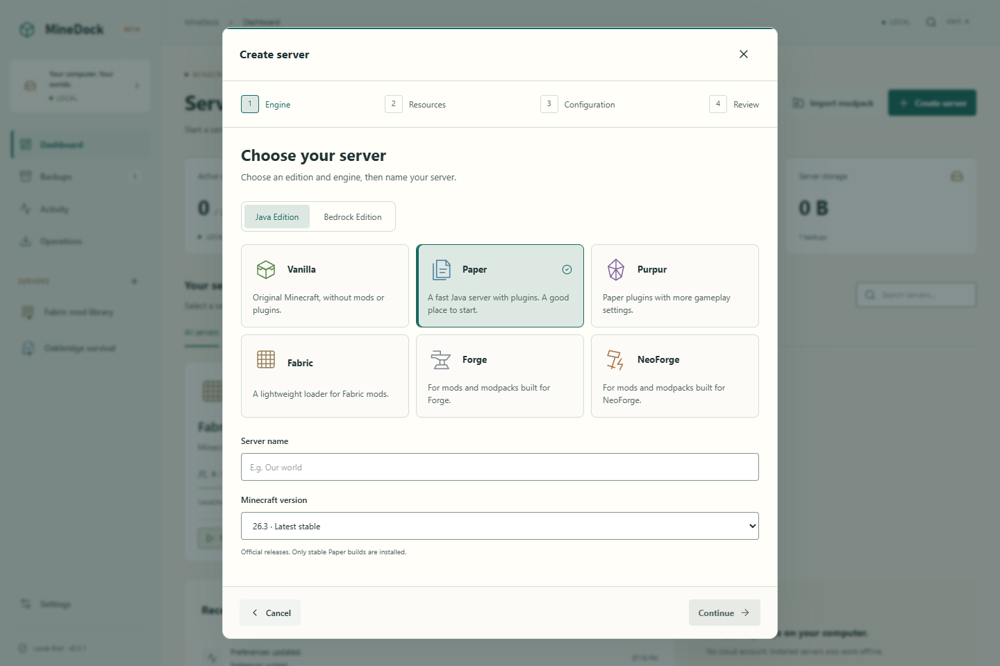 |
| Light server    | 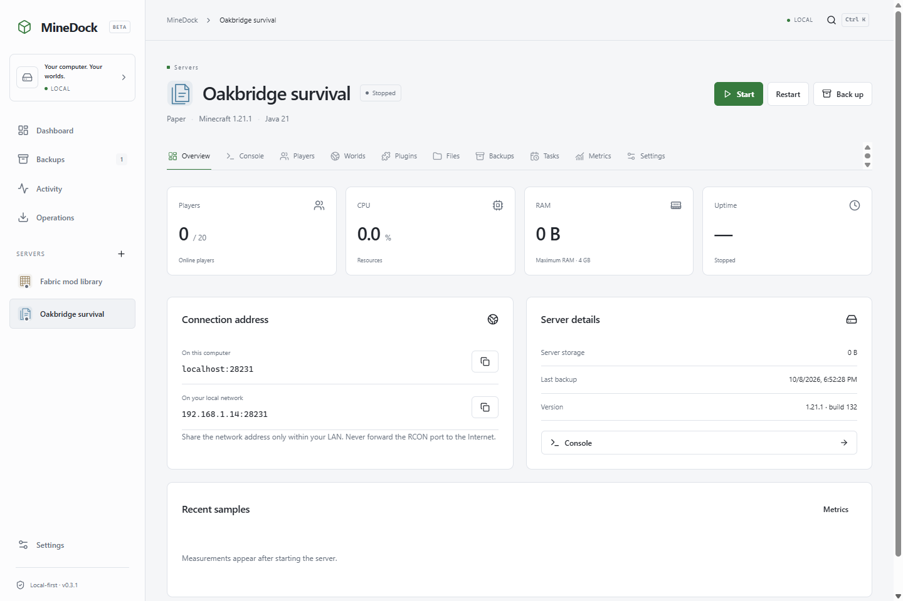        | 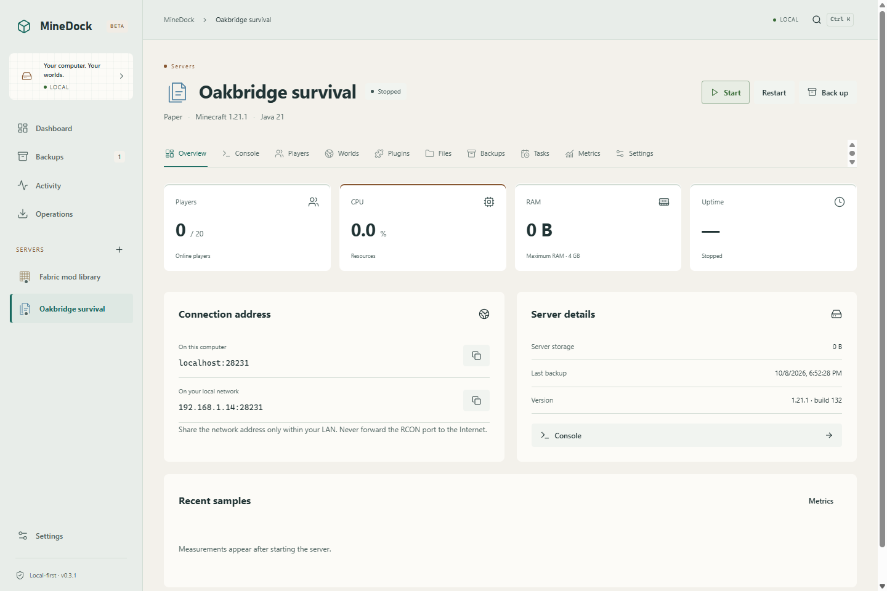        |
| Light mods      | 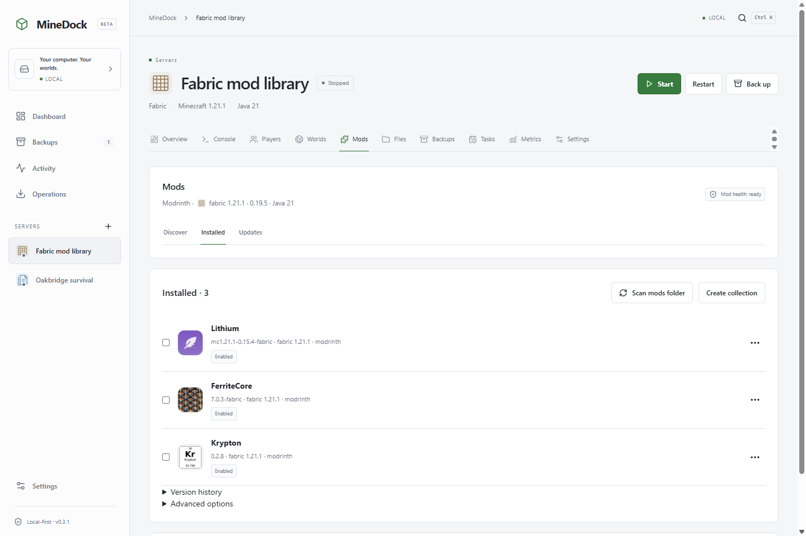           | 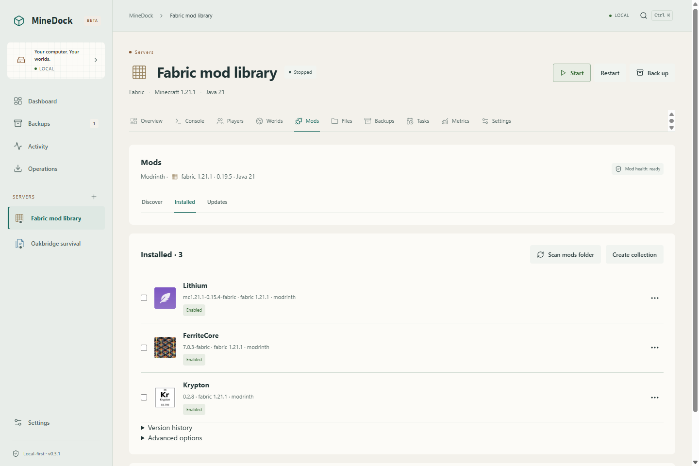           |

The native comparison measures **181 rectangles across 26 views/states**: sidebar, header, page actions, metric/server grids and cards, dialogs, wizard steps/options/footer, tabs, mod panels and installed rows. Positions, sizes, display/position modes, grid columns, gaps and padding agree within **0.5 CSS pixels**. This is evidence for the sampled native capture profile; responsive behavior is checked separately at 760 × 520, 1360 × 900, 1920 × 1080 and 2560 × 1440, in both themes. Existing small-dialog tests also cover 480 × 500.

The [native measurement record](layout-review.json) includes every sampled before/after rectangle and layout property, with zero differences beyond that tolerance.

## Capture provenance and coverage

The production Electron/main/preload/SQLite application is used, with private review profiles. Mod data comes from actual Modrinth metadata and downloaded SHA-512-verified Lithium, FerriteCore and Krypton JARs. Server files, world metadata, player observations, a verified archive and a paused daily task are isolated QA records. The active-server/console views use a purpose-built external Node child with real process/log/RCON lifecycle; **that child is not Minecraft** and is never shipped. No owner production server, game client, real Minecraft EULA acceptance or gameplay is involved.

Current captures cover onboarding, empty dashboard, dashboard stopped/active/light, creation/review/light, server stopped/active/light, console stopped/active/light, mods/light/actions menu, plugins, players, worlds, files, backups, scheduler, settings/light and runtimes. Import preview uses an actual native-selected private source folder and the production preview service. All former current gallery images are replaced; historical comparison images are labeled and kept under `docs/design/before`.

Reproduce with `pnpm build` followed by `pnpm screenshots`. The command uses only `data/visual-review`, creates isolated profiles when needed and downloads three actual compatible Modrinth mods on first use. No real Minecraft process is started. `pnpm screenshots before` targets historical comparison output and should only be run against the previous style revision. User storage, keys and capture profiles stay ignored by Git.

The full source UI suite includes a new readability/focus/responsive-state case, with 23 contrast checks per theme. Text targets 4.5:1 and keyboard focus 3:1. All eight state badges, mod status badges, primary/secondary/disabled text and console levels are checked. This complements actual native execution and manual visual inspection; it is not an exhaustive accessibility audit.

See [validation](../validation.md) for exact tests/build results and [the gallery](../screenshots/README.md) for current image links.
